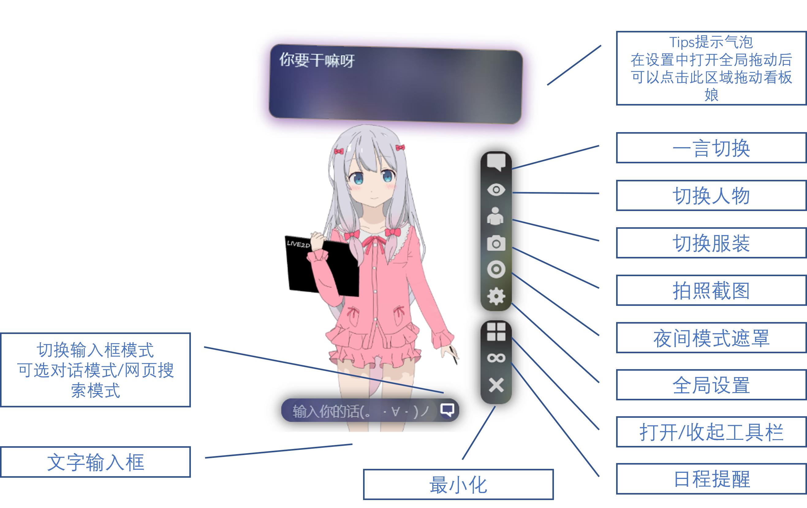

<h1 align="center"> Kanban-Desktop </h1>
<h3 align="center"> An AI Based Kanban for Windows and Linux* Desktop Users </h3>
 

---

### 🎉可以在你的桌面上随意调教的看板娘！专为Windows与Linux、Mac 桌面设计，模型库丰富，支持云端与本地模型加载**，功能全面，持续不定期更新中（咕咕咕）
---
## 🎰目前拥有的功能有：
- 特别为桌面用户优化的伪·高斯模糊UI以及工具箱设计，更方便桌面使用
- ~~承接上一代网页版本，接入腾讯NLP，支持文字实时对话，支持自己部署NLP服务~~
- 加入ChatGPT-API支持，填入APIKey后即可解锁ChatGPT对话功能，现已支持自定GPT API
- 底部输入框一键切换网页搜索，可以方便地随时搜索所需的内容，更可以随时切换自定义搜索引擎
- 全新的接入原生通知的日程提醒功能，只要输入倒数时间与提醒内容即可到点提醒，同时包括多种取自MIUI的随机通知铃声
- 全新小窗模式，在需要专心工作/不想暴露自己是个2ch的时候，可以点击叉号进入小窗专注模式，此时，看板娘将最小化为气泡在右下角待命
- 小窗气泡新增自定义背景功能，更加个性化
- 云端api加入大量全新模型，设置窗口中可以自行填写自建api地址
- 本地模型加载，可选择本地模型Json文件（实验性）或云端API加载模型
- Live2D V2~V5 全版本模型支持
- 自定义缩放与模型坐标位置，自由调节模型显示大小与位置
- 2x高清渲染，看板娘画质更清晰，高分屏全面适配
- 加入全局设置，基于WinUI3的全新设置窗口，工具箱功能可以自己设定，看板娘行为也可以全局设置并保存
- 桌面全局拖拽，按住拖拽手柄拖动即可全局拖拽，放在哪里都合适
- 更多功能仍在努力开发中，你可以在本仓库的Projects选项卡内查看相关开发进度
---
## 📺安装：
原项目只打包了window和Linux系统的，基于修改适配Mac系统，更改模型API地址
win和Linux下载地址：[Release](https://github.com/JimHans/kanban-desktop/releases)

---
## 📚使用指南：
 

---
## 📌注意：
- #### 1.本项目使用Electron开发，支持Windows,Mac OS,Linux跨平台运行。Release中默认只提供Windows安装包，如果需要其他平台使用，你可以使用`git clone` 本仓库后在本地编译打包。
- #### 2.在使用本项目自带的NLP时，请注意不要发送过多请求导致腾讯云API免费次数到达限制。在2.0.0版本后，本项目在设置中加入了NLPAPI手动填写功能，并对公用API设置限制。自行注册腾讯云API的方式，请见下方附录教程
- #### 3.本项目使用的模型文件版权均归相关版权方所有，2.2.0版本后，本项目已在设置中提供自建模型API选项，并已加入本地模型加载功能来避开这个限制。/*至于这个功能什么时候上线，我也不知道ㄟ( ▔, ▔ )ㄏ*/
- #### 4.在使用moc3模型加载模式时，根据Cubism EULA条款，本程序无法自带渲染器分发，因此默认使用官方CDN提供支持，若需要离线使用，请参照软件内提示自行下载渲染器文件并放置在软件根目录下。
- #### 5.由于使用Electron进行构建，所以性能开销略大，耗电量较高，不建议给笔记本使用，建议挂在台式机食用

---

